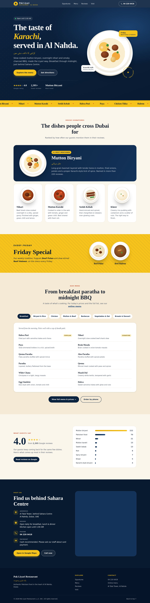

# Pak Liyari Restaurant — Website

A static, single-page website for Pak Liyari Restaurant (Al Nahda, Dubai). No build step is needed.

## Files
- `index.html`: page content, SEO meta tags and Restaurant structured data
- `styles.css`: design (navy and saffron, taken from the storefront)
- `script.js`: menu data and tabs, mobile nav, scroll effects
- `assets/favicon.svg`: site icon

## Preview
Open `index.html` in a browser, or run `python3 -m http.server` and visit http://localhost:8000.

## Deploy
Upload the folder to any static host (Netlify, Vercel, GitHub Pages, Cloudflare Pages).

## Editing the menu
Edit the `MENU` array at the top of `script.js`. Each item has a `name`, a `desc` and an optional `tag`.
Prices are not shown on this site. The "View full menu" buttons link to https://menu.pakliyarirestaurant.com.

## To confirm with the restaurant
- Opening time (the site currently says "until 1:00 AM" only)
- Payment methods (the site says "cash recommended")
- Real food photos, which could replace the illustrated plates
